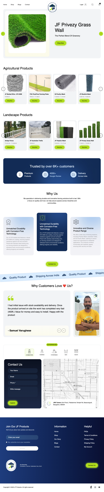

# 🚀 [Grass Wall]



A modern React application that its a modern landing page that i created for a job task.

## ✨ Features

- Clean Code
- Fixel Perfect UI
- Reuseable Component

## 🛠️ Tech Stack

- **Frontend**: React, Vite
- **Styling**: [TailwindCSS]
- **Routing**: React Router DOM

## 📦 Installation

1. Clone the repository:
   ```bash
   git clone https://github.com/alamshuvo/grass-wall-frontend.git
   ```
2. Install Dependencies

```bash
cd project-name
npm install
```
3. Run the development server:
```bash 
npm run dev
```

4. Project Structure
 src/
├── assets/            
├── components/       
├── Shared/           
├── App.jsx           
└── main.jsx           